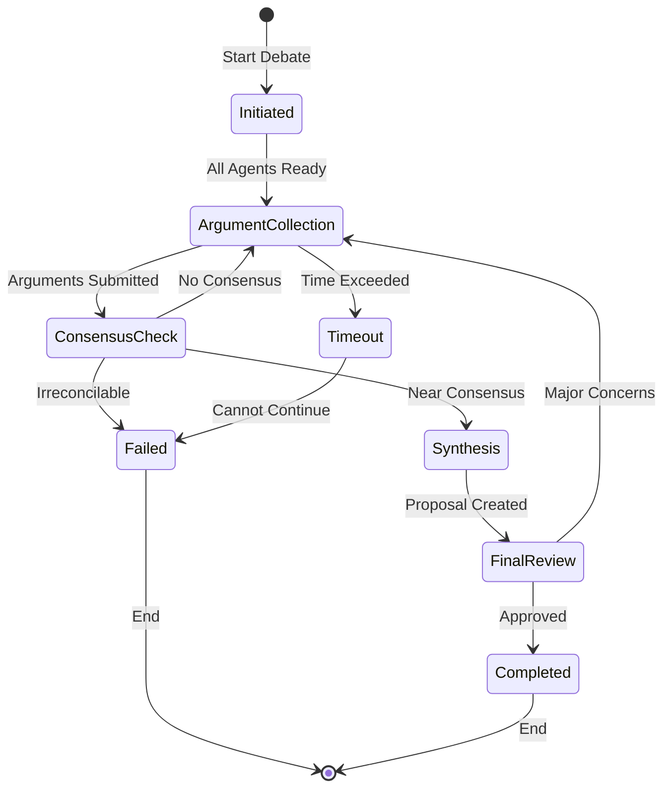
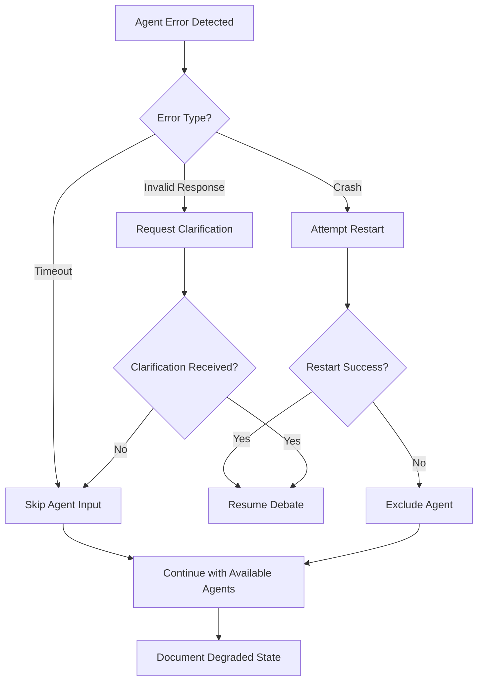
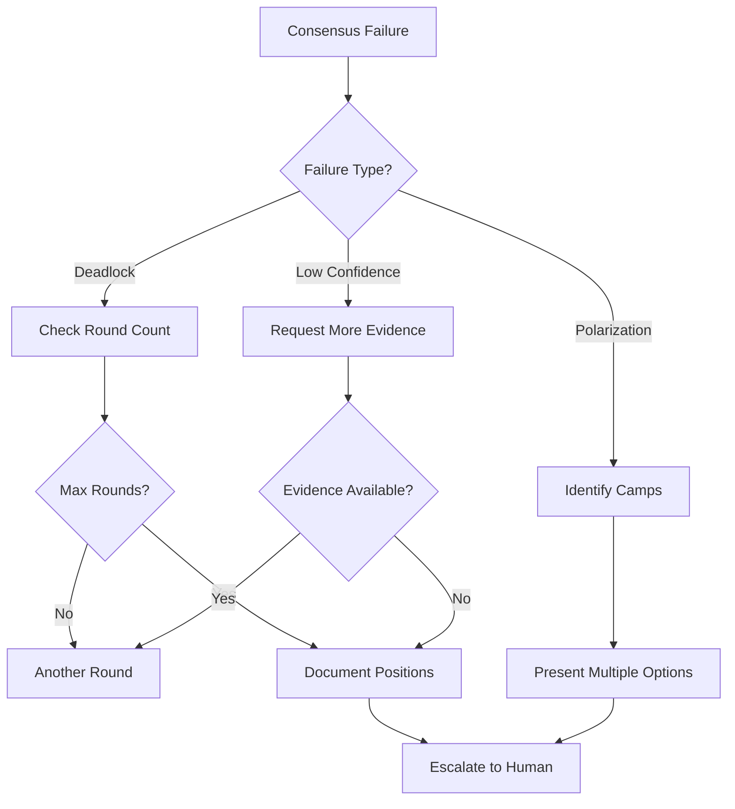
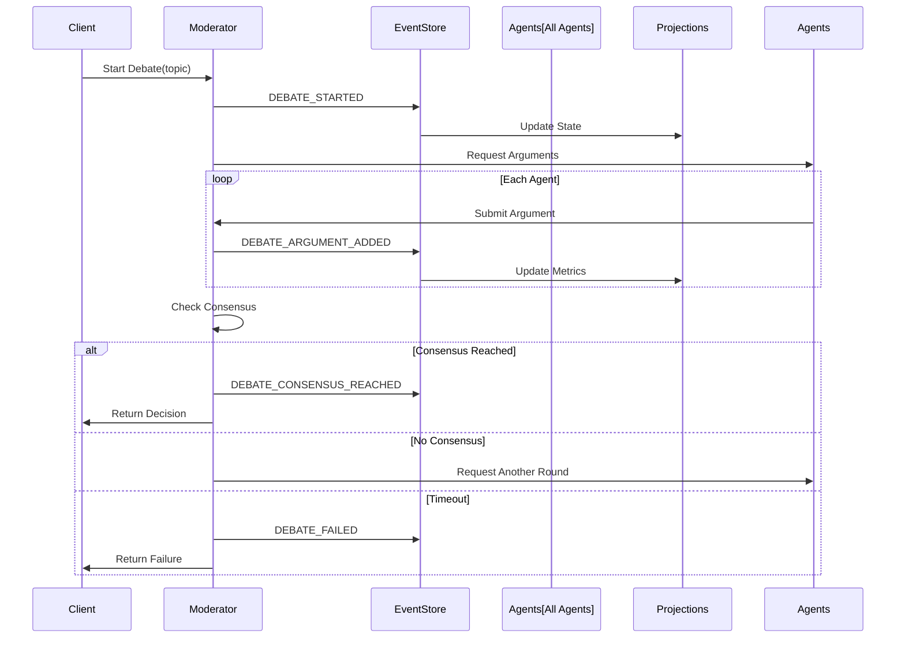

# 🤖 AURA Intelligence Agent Documentation

## Table of Contents
1. [Agent Roles](#agent-roles)
2. [State Transitions](#state-transitions)
3. [Error Handling](#error-handling)
4. [Event Flow](#event-flow)
5. [Communication Protocols](#communication-protocols)

---

## 🎭 Agent Roles

### 1. Philosopher Agent
**Purpose**: Provides ethical and philosophical perspectives on debates

**Responsibilities**:
- Analyze ethical implications of proposals
- Consider long-term societal impacts
- Raise questions about fundamental assumptions
- Bridge theoretical concepts with practical applications

**Key Behaviors**:
```python
# Example philosophical argument structure
{
    "perspective": "deontological",
    "principle": "categorical imperative",
    "argument": "This decision must be universalizable...",
    "implications": ["societal", "individual", "environmental"],
    "confidence": 0.85
}
```

**Error Handling**:
- Gracefully handles ambiguous ethical scenarios
- Falls back to first principles when specific guidance unavailable
- Logs uncertainty levels for transparency

### 2. Scientist Agent
**Purpose**: Provides empirical, evidence-based analysis

**Responsibilities**:
- Evaluate proposals against scientific evidence
- Identify testable hypotheses
- Assess technical feasibility
- Quantify uncertainty and risk

**Key Behaviors**:
```python
# Example scientific argument structure
{
    "hypothesis": "Implementation will reduce latency by 40%",
    "evidence": ["benchmark_data", "research_papers", "case_studies"],
    "methodology": "controlled experiment",
    "confidence_interval": [0.35, 0.45],
    "limitations": ["sample size", "environmental factors"]
}
```

**Error Handling**:
- Explicitly states when evidence is insufficient
- Provides confidence intervals rather than point estimates
- Suggests experiments to gather missing data

### 3. Pragmatist Agent
**Purpose**: Focuses on practical implementation and real-world constraints

**Responsibilities**:
- Assess resource requirements
- Identify implementation challenges
- Propose actionable solutions
- Balance ideal vs. achievable outcomes

**Key Behaviors**:
```python
# Example pragmatic argument structure
{
    "feasibility": "high",
    "resource_requirements": {
        "time": "3 months",
        "budget": "$50,000",
        "personnel": "5 engineers"
    },
    "risks": ["technical debt", "market timing"],
    "implementation_plan": ["phase1", "phase2", "phase3"]
}
```

**Error Handling**:
- Provides alternative approaches when primary plan unfeasible
- Escalates resource conflicts early
- Documents assumptions and dependencies

### 4. Synthesizer Agent
**Purpose**: Integrates diverse perspectives into coherent proposals

**Responsibilities**:
- Identify common ground between agents
- Resolve contradictions
- Create balanced recommendations
- Facilitate consensus building

**Key Behaviors**:
```python
# Example synthesis structure
{
    "common_ground": ["shared values", "agreed facts"],
    "tensions": {
        "ethics_vs_pragmatism": "resolved through phased approach",
        "evidence_vs_timeline": "addressed with pilot program"
    },
    "integrated_proposal": "...",
    "consensus_level": 0.87
}
```

**Error Handling**:
- Explicitly acknowledges irreconcilable differences
- Proposes multiple options when consensus impossible
- Documents minority opinions

### 5. Areopagus Moderator
**Purpose**: Orchestrates debate flow and ensures productive discourse

**Responsibilities**:
- Manage debate lifecycle
- Enforce time constraints
- Ensure all perspectives heard
- Determine consensus achievement

**Key Behaviors**:
```python
# Example moderation actions
{
    "action": "request_clarification",
    "target_agent": "Scientist",
    "reason": "insufficient evidence provided",
    "timeout": 30,
    "fallback": "proceed_without_clarification"
}
```

**Error Handling**:
- Implements debate timeouts
- Handles non-responsive agents
- Escalates deadlocks appropriately

---

## 🔄 State Transitions

### Debate State Machine



### State Definitions

#### 1. **Initiated**
- Debate topic established
- Agents initialized
- Context loaded
- **Duration**: < 5 seconds
- **Success Criteria**: All agents responsive

#### 2. **ArgumentCollection**
- Agents formulate positions
- Parallel processing enabled
- Evidence gathering active
- **Duration**: 30-120 seconds per round
- **Success Criteria**: All agents submit arguments

#### 3. **ConsensusCheck**
- Analyze argument alignment
- Calculate consensus metrics
- Identify key disagreements
- **Duration**: 5-10 seconds
- **Success Criteria**: Consensus > 0.7 or max rounds reached

#### 4. **Synthesis**
- Integrate perspectives
- Resolve conflicts
- Create unified proposal
- **Duration**: 20-40 seconds
- **Success Criteria**: Coherent proposal generated

#### 5. **FinalReview**
- All agents review synthesis
- Vote on acceptance
- Document reservations
- **Duration**: 10-20 seconds
- **Success Criteria**: Majority approval

#### 6. **Completed**
- Consensus achieved
- Decision documented
- Events published
- **Duration**: < 5 seconds
- **Success Criteria**: Clean shutdown

#### 7. **Failed**
- Timeout or deadlock
- Irreconcilable differences
- System errors
- **Duration**: < 5 seconds
- **Success Criteria**: Graceful termination

### Transition Rules

| From State | To State | Condition | Event Emitted |
|------------|----------|-----------|---------------|
| Initiated | ArgumentCollection | All agents ready | DEBATE_STARTED |
| ArgumentCollection | ConsensusCheck | All arguments received | DEBATE_ARGUMENT_ADDED (multiple) |
| ConsensusCheck | ArgumentCollection | Consensus < 0.7 & rounds < max | CONSENSUS_CHECK_FAILED |
| ConsensusCheck | Synthesis | Consensus >= 0.7 | CONSENSUS_EMERGING |
| ConsensusCheck | Failed | Rounds >= max & consensus < 0.5 | DEBATE_DEADLOCKED |
| Synthesis | FinalReview | Synthesis complete | SYNTHESIS_CREATED |
| FinalReview | Completed | Approval >= 0.6 | DEBATE_CONSENSUS_REACHED |
| FinalReview | ArgumentCollection | Approval < 0.6 | SYNTHESIS_REJECTED |
| * | Timeout | Duration > max_time | DEBATE_TIMEOUT |
| Timeout | Failed | Cannot recover | DEBATE_FAILED |

---

## ⚠️ Error Handling

### Error Categories

#### 1. **Agent Failures**
```python
class AgentFailure(Exception):
    """Base class for agent-specific failures"""
    
    def __init__(self, agent_id: str, reason: str):
        self.agent_id = agent_id
        self.reason = reason
        self.timestamp = datetime.utcnow()
        
class AgentTimeoutError(AgentFailure):
    """Agent failed to respond within timeout"""
    default_timeout = 30  # seconds
    
class AgentCrashError(AgentFailure):
    """Agent process crashed or became unresponsive"""
    recovery_attempts = 3
```

**Handling Strategy**:
1. **Timeout**: Skip agent input, proceed with available data
2. **Crash**: Attempt restart, then exclude from debate
3. **Invalid Response**: Request clarification once, then skip

#### 2. **Consensus Failures**
```python
class ConsensusFailure(Exception):
    """Base class for consensus-related failures"""
    
class DeadlockError(ConsensusFailure):
    """Agents cannot reach minimum consensus"""
    min_consensus_threshold = 0.5
    
class PolarizationError(ConsensusFailure):
    """Agents split into opposing camps"""
    max_polarization_score = 0.8
```

**Handling Strategy**:
1. **Deadlock**: Document positions, escalate to human
2. **Polarization**: Present multiple options
3. **Timeout**: Use best available consensus

#### 3. **System Failures**
```python
class SystemFailure(Exception):
    """Base class for infrastructure failures"""
    
class EventStoreFailure(SystemFailure):
    """Cannot persist events"""
    retry_attempts = 5
    backoff_factor = 2
    
class ProjectionFailure(SystemFailure):
    """Projection out of sync"""
    max_lag_seconds = 60
```

**Handling Strategy**:
1. **Event Store**: Buffer events, retry with backoff
2. **Projections**: Continue with stale data, alert ops
3. **Network**: Circuit breaker pattern

### Error Recovery Workflows

#### Agent Recovery


#### Consensus Recovery


---

## 📊 Event Flow

### Event Sequence Diagram



### Event Types Reference

| Event Type | Payload | When Emitted | Side Effects |
|------------|---------|--------------|--------------|
| DEBATE_STARTED | topic, context, debate_id | Debate initiated | Agents activated |
| DEBATE_ARGUMENT_ADDED | agent_id, argument, evidence | Agent submits | Metrics updated |
| CONSENSUS_CHECK_PERFORMED | consensus_score, round | After each round | May trigger synthesis |
| SYNTHESIS_CREATED | proposal, confidence | Synthesis complete | Triggers review |
| DEBATE_CONSENSUS_REACHED | decision, participants | Success | Notifications sent |
| DEBATE_FAILED | reason, partial_results | Failure | Cleanup triggered |
| AGENT_ERROR | agent_id, error_type | Agent fails | Recovery initiated |

---

## 🔌 Communication Protocols

### Inter-Agent Communication

#### Message Format
```python
@dataclass
class AgentMessage:
    sender_id: str
    recipient_id: str  # "all" for broadcast
    message_type: MessageType
    content: Dict[str, Any]
    correlation_id: UUID
    timestamp: datetime
    requires_response: bool = False
    timeout: Optional[int] = None
```

#### Message Types
1. **ARGUMENT**: Present position on topic
2. **EVIDENCE_REQUEST**: Request supporting data
3. **CLARIFICATION_REQUEST**: Seek elaboration
4. **OBJECTION**: Challenge another's position
5. **AGREEMENT**: Express alignment
6. **SYNTHESIS_PROPOSAL**: Suggest compromise

### Protocol Rules

1. **Ordered Delivery**: Messages processed in timestamp order
2. **At-Most-Once**: Duplicate messages filtered by correlation_id
3. **Timeout Handling**: Unanswered requests timeout gracefully
4. **Broadcast Efficiency**: Multicast for "all" recipients
5. **Priority Queuing**: Moderator messages prioritized

### Example Communication Flow
```python
# Philosopher challenges Scientist's evidence
philosopher_msg = AgentMessage(
    sender_id="philosopher_001",
    recipient_id="scientist_001",
    message_type=MessageType.OBJECTION,
    content={
        "target_claim": "AI improves decision making",
        "objection": "Ignores human agency concerns",
        "evidence": ["Kant's autonomy principle", "Recent studies on AI bias"]
    },
    correlation_id=uuid4(),
    timestamp=datetime.utcnow(),
    requires_response=True,
    timeout=30
)

# Scientist responds with clarification
scientist_response = AgentMessage(
    sender_id="scientist_001",
    recipient_id="philosopher_001",
    message_type=MessageType.CLARIFICATION,
    content={
        "clarification": "AI augments, not replaces human decisions",
        "supporting_data": ["Study A", "Study B"],
        "confidence": 0.82
    },
    correlation_id=philosopher_msg.correlation_id,  # Links to original
    timestamp=datetime.utcnow()
)
```

---

## 📋 Operational Guidelines

### Monitoring Requirements
- Track agent response times (p50, p95, p99)
- Monitor consensus convergence rate
- Alert on repeated failures
- Dashboard for debate outcomes

### Performance Targets
- Agent response time: < 10s (p95)
- Debate completion: < 5 minutes (p95)
- Consensus achievement rate: > 70%
- System availability: 99.9%

### Scaling Considerations
- Agents stateless for horizontal scaling
- Event store partitioned by debate_id
- Projections sharded by time window
- Circuit breakers prevent cascade failures

---

*This documentation is version controlled and should be updated with any architectural changes to the agent system.*