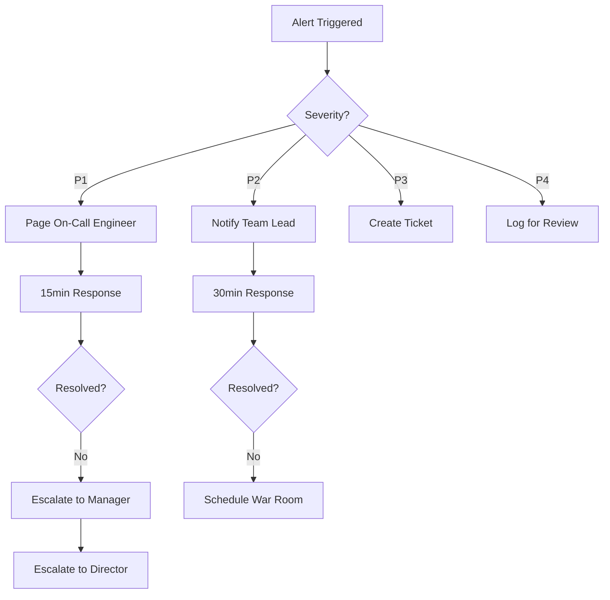

# 📚 STREAMING TDA OPERATIONS RUNBOOK
## Production Operations, Troubleshooting, and Maintenance Guide

---

## 📋 Table of Contents

1. [System Overview](#system-overview)
2. [Deployment Procedures](#deployment-procedures)
3. [Monitoring & Alerts](#monitoring--alerts)
4. [Common Issues & Solutions](#common-issues--solutions)
5. [Performance Tuning](#performance-tuning)
6. [Disaster Recovery](#disaster-recovery)
7. [Maintenance Procedures](#maintenance-procedures)
8. [Escalation Procedures](#escalation-procedures)

---

## 🎯 System Overview

### Architecture Components

```
┌─────────────────────────────────────────────────────────────┐
│                    Streaming TDA Platform                     │
├─────────────────────────────────────────────────────────────┤
│                                                               │
│  ┌─────────────┐    ┌──────────────┐    ┌───────────────┐  │
│  │   Kafka      │    │  Streaming   │    │  Persistence  │  │
│  │   Event      │───▶│     TDA      │───▶│   Storage     │  │
│  │   Mesh       │    │  Processor   │    │  (Redis/S3)   │  │
│  └─────────────┘    └──────────────┘    └───────────────┘  │
│         │                   │                     │          │
│         └───────────────────┴─────────────────────┘          │
│                             │                                 │
│                    ┌────────────────┐                        │
│                    │  Observability │                        │
│                    │  (Prometheus/  │                        │
│                    │   Grafana)     │                        │
│                    └────────────────┘                        │
└─────────────────────────────────────────────────────────────┘
```

### Key Metrics

| Metric | Target | Alert Threshold |
|--------|--------|-----------------|
| Throughput | >10K events/sec | <5K events/sec |
| P99 Latency | <100ms | >200ms |
| Error Rate | <0.1% | >1% |
| Memory Usage | <8GB | >12GB |
| Kafka Lag | <1000 | >5000 |

---

## 🚀 Deployment Procedures

### Pre-Deployment Checklist

```bash
#!/bin/bash
# Pre-deployment validation script

echo "🔍 Running pre-deployment checks..."

# 1. Check system resources
echo "Checking system resources..."
free -h
df -h
cpu_count=$(nproc)
if [ $cpu_count -lt 8 ]; then
    echo "⚠️ WARNING: Less than 8 CPUs available"
fi

# 2. Verify dependencies
echo "Verifying dependencies..."
python3 -c "import aura_intelligence; print(f'Version: {aura_intelligence.__version__}')"
kafka-topics --version
redis-cli --version

# 3. Run tests
echo "Running smoke tests..."
pytest tests/smoke -v --timeout=60

# 4. Check configuration
echo "Validating configuration..."
python3 -m aura_intelligence.config.validate --config production.yaml

# 5. Backup current state
echo "Creating backup..."
./scripts/backup-state.sh

echo "✅ Pre-deployment checks complete"
```

### Deployment Steps

#### 1. Blue-Green Deployment

```bash
# Deploy to green environment
kubectl apply -f k8s/streaming-tda-green.yaml

# Wait for readiness
kubectl wait --for=condition=ready pod -l app=streaming-tda,version=green --timeout=300s

# Run health checks
./scripts/health-check.sh green

# Switch traffic
kubectl patch service streaming-tda -p '{"spec":{"selector":{"version":"green"}}}'

# Monitor for 5 minutes
./scripts/monitor-deployment.sh 300

# If issues, rollback
# kubectl patch service streaming-tda -p '{"spec":{"selector":{"version":"blue"}}}'
```

#### 2. Rolling Update

```yaml
# k8s/streaming-tda-deployment.yaml
apiVersion: apps/v1
kind: Deployment
metadata:
  name: streaming-tda
spec:
  replicas: 6
  strategy:
    type: RollingUpdate
    rollingUpdate:
      maxSurge: 2
      maxUnavailable: 1
  template:
    spec:
      containers:
      - name: streaming-tda
        image: streaming-tda:latest
        livenessProbe:
          httpGet:
            path: /health
            port: 8080
          initialDelaySeconds: 30
          periodSeconds: 10
        readinessProbe:
          httpGet:
            path: /ready
            port: 8080
          initialDelaySeconds: 10
          periodSeconds: 5
```

### Post-Deployment Validation

```python
#!/usr/bin/env python3
"""Post-deployment validation script"""

import asyncio
import aiohttp
import time
from datetime import datetime

async def validate_deployment():
    """Validate deployment health"""
    
    checks = {
        'health': 'http://streaming-tda:8080/health',
        'metrics': 'http://streaming-tda:8080/metrics',
        'ready': 'http://streaming-tda:8080/ready'
    }
    
    async with aiohttp.ClientSession() as session:
        for name, url in checks.items():
            try:
                async with session.get(url) as response:
                    if response.status == 200:
                        print(f"✅ {name}: OK")
                    else:
                        print(f"❌ {name}: Failed (status={response.status})")
                        return False
            except Exception as e:
                print(f"❌ {name}: Error - {e}")
                return False
                
    # Check processing metrics
    print("\n📊 Checking processing metrics...")
    
    # Send test events
    test_events = generate_test_events(100)
    await send_test_events(test_events)
    
    # Wait for processing
    await asyncio.sleep(5)
    
    # Verify results
    metrics = await get_metrics()
    
    if metrics['events_processed'] >= 100:
        print("✅ Event processing: OK")
    else:
        print(f"❌ Event processing: Only {metrics['events_processed']}/100 processed")
        return False
        
    return True

if __name__ == "__main__":
    success = asyncio.run(validate_deployment())
    exit(0 if success else 1)
```

---

## 📊 Monitoring & Alerts

### Key Dashboards

#### 1. System Overview Dashboard

Access: `https://grafana.example.com/d/streaming-tda-overview`

Key Panels:
- Event throughput (events/sec)
- Processing latency (p50, p90, p99)
- Error rate
- Resource utilization (CPU, Memory, Network)
- Kafka consumer lag

#### 2. Performance Dashboard

Access: `https://grafana.example.com/d/streaming-tda-performance`

Key Panels:
- TDA computation time by scale
- Persistence diagram update frequency
- Memory usage by component
- GC pause times
- Thread pool utilization

### Alert Rules

```yaml
# prometheus/alerts/streaming-tda.yml
groups:
  - name: streaming_tda
    interval: 30s
    rules:
      # High latency alert
      - alert: StreamingTDAHighLatency
        expr: streaming_tda_latency_p99 > 0.2
        for: 5m
        labels:
          severity: warning
          team: platform
        annotations:
          summary: "High P99 latency detected"
          description: "P99 latency is {{ $value }}s (threshold: 0.2s)"
          runbook: "https://wiki.example.com/streaming-tda-high-latency"
          
      # Low throughput alert
      - alert: StreamingTDALowThroughput
        expr: rate(streaming_tda_events_processed_total[5m]) < 5000
        for: 10m
        labels:
          severity: warning
          team: platform
        annotations:
          summary: "Low throughput detected"
          description: "Processing {{ $value }} events/sec (threshold: 5000)"
          
      # Memory leak alert
      - alert: StreamingTDAMemoryLeak
        expr: rate(process_resident_memory_bytes[1h]) > 100000000
        for: 30m
        labels:
          severity: critical
          team: platform
        annotations:
          summary: "Potential memory leak detected"
          description: "Memory growing at {{ $value }} bytes/hour"
          
      # Kafka lag alert
      - alert: StreamingTDAKafkaLag
        expr: kafka_consumer_lag > 10000
        for: 5m
        labels:
          severity: warning
          team: platform
        annotations:
          summary: "High Kafka consumer lag"
          description: "Consumer lag is {{ $value }} messages"
```

### Monitoring Commands

```bash
# Check system status
curl -s http://localhost:8080/health | jq .

# View current metrics
curl -s http://localhost:8080/metrics | grep streaming_tda

# Check Kafka consumer groups
kafka-consumer-groups --bootstrap-server localhost:9092 \
  --group streaming-tda-consumers --describe

# Monitor logs
kubectl logs -f deployment/streaming-tda --tail=100

# Watch resource usage
kubectl top pods -l app=streaming-tda --watch
```

---

## 🔧 Common Issues & Solutions

### Issue 1: High Latency Spikes

**Symptoms:**
- P99 latency > 200ms
- Intermittent timeouts
- Queue buildup

**Diagnosis:**
```bash
# Check GC activity
jstat -gcutil <pid> 1000 10

# Profile hot methods
async-profiler -d 30 -f /tmp/profile.html <pid>

# Check thread dumps
jstack <pid> > thread_dump.txt
```

**Solutions:**
1. **Increase heap size**:
   ```bash
   export JAVA_OPTS="-Xmx16g -Xms16g -XX:+UseG1GC"
   ```

2. **Tune GC**:
   ```bash
   -XX:MaxGCPauseMillis=50
   -XX:G1HeapRegionSize=32m
   -XX:InitiatingHeapOccupancyPercent=70
   ```

3. **Scale horizontally**:
   ```bash
   kubectl scale deployment streaming-tda --replicas=8
   ```

### Issue 2: Kafka Rebalancing Storms

**Symptoms:**
- Frequent rebalances
- Processing interruptions
- Duplicate processing

**Diagnosis:**
```bash
# Check consumer group status
kafka-consumer-groups --bootstrap-server localhost:9092 \
  --group streaming-tda-consumers --describe --state

# View rebalance history
grep "Rebalance" /var/log/streaming-tda/*.log | tail -20
```

**Solutions:**
1. **Increase session timeout**:
   ```python
   consumer_config = {
       'session.timeout.ms': 60000,
       'heartbeat.interval.ms': 20000,
       'max.poll.interval.ms': 300000
   }
   ```

2. **Implement sticky assignment**:
   ```python
   consumer_config['partition.assignment.strategy'] = 'cooperative-sticky'
   ```

3. **Add rebalance listener**:
   ```python
   class RebalanceListener:
       def on_partitions_revoked(self, revoked):
           # Commit current state
           self.commit_state()
           
       def on_partitions_assigned(self, assigned):
           # Restore state for new partitions
           self.restore_state(assigned)
   ```

### Issue 3: Memory Leaks

**Symptoms:**
- Steadily increasing memory usage
- OOM errors
- Performance degradation over time

**Diagnosis:**
```python
# Memory profiler script
import tracemalloc
import psutil
import gc

def diagnose_memory():
    # Start tracing
    tracemalloc.start()
    
    # Run for some time
    time.sleep(300)
    
    # Get top memory users
    snapshot = tracemalloc.take_snapshot()
    top_stats = snapshot.statistics('lineno')
    
    print("Top 10 memory allocations:")
    for stat in top_stats[:10]:
        print(stat)
        
    # Check for uncollected objects
    gc.collect()
    print(f"\nUncollected objects: {len(gc.garbage)}")
    
    # Process memory
    process = psutil.Process()
    print(f"\nMemory usage: {process.memory_info().rss / 1024 / 1024:.1f} MB")
```

**Solutions:**
1. **Fix circular references**:
   ```python
   # Use weak references
   import weakref
   
   class StreamingWindow:
       def __init__(self, processor):
           self.processor = weakref.ref(processor)
   ```

2. **Implement memory limits**:
   ```python
   # Memory-bounded cache
   from cachetools import LRUCache
   
   self.cache = LRUCache(maxsize=10000)
   ```

3. **Regular cleanup**:
   ```python
   async def periodic_cleanup():
       while True:
           await asyncio.sleep(3600)  # Every hour
           gc.collect()
           self.cleanup_old_data()
   ```

### Issue 4: Data Quality Issues

**Symptoms:**
- Incorrect persistence diagrams
- Missing features
- Inconsistent results

**Diagnosis:**
```python
# Data validation script
def validate_data_quality():
    # Sample recent data
    recent_data = get_recent_processed_data(1000)
    
    # Check for anomalies
    anomalies = []
    
    for record in recent_data:
        # Check data completeness
        if missing_fields(record):
            anomalies.append(('missing_fields', record))
            
        # Check value ranges
        if out_of_range(record):
            anomalies.append(('out_of_range', record))
            
        # Check consistency
        if not consistent_with_schema(record):
            anomalies.append(('schema_violation', record))
            
    return anomalies
```

**Solutions:**
1. **Add input validation**:
   ```python
   @dataclass
   class DataValidator:
       def validate(self, data: np.ndarray) -> bool:
           # Check shape
           if data.ndim != 2:
               return False
               
           # Check for NaN/Inf
           if np.any(np.isnan(data)) or np.any(np.isinf(data)):
               return False
               
           # Check value ranges
           if np.any(data < self.min_value) or np.any(data > self.max_value):
               return False
               
           return True
   ```

2. **Implement data cleaning**:
   ```python
   def clean_data(data: np.ndarray) -> np.ndarray:
       # Remove outliers
       q1, q3 = np.percentile(data, [25, 75], axis=0)
       iqr = q3 - q1
       lower = q1 - 1.5 * iqr
       upper = q3 + 1.5 * iqr
       
       mask = np.all((data >= lower) & (data <= upper), axis=1)
       return data[mask]
   ```

---

## ⚡ Performance Tuning

### CPU Optimization

```python
# Enable CPU affinity
import os
import psutil

def set_cpu_affinity():
    # Get available CPUs
    cpu_count = psutil.cpu_count()
    
    # Reserve CPUs for critical threads
    main_cpus = list(range(0, cpu_count // 2))
    worker_cpus = list(range(cpu_count // 2, cpu_count))
    
    # Set affinity
    p = psutil.Process()
    p.cpu_affinity(main_cpus)
    
    # Configure thread pools
    os.environ['OMP_NUM_THREADS'] = str(len(worker_cpus))
    os.environ['MKL_NUM_THREADS'] = str(len(worker_cpus))
```

### Memory Optimization

```python
# Memory pool for frequent allocations
from multiprocessing import shared_memory

class MemoryPool:
    def __init__(self, size_mb: int = 1000):
        self.pool_size = size_mb * 1024 * 1024
        self.shm = shared_memory.SharedMemory(
            create=True,
            size=self.pool_size
        )
        self.allocations = {}
        
    def allocate(self, size: int) -> np.ndarray:
        # Find free block
        offset = self._find_free_block(size)
        
        # Create array view
        array = np.ndarray(
            shape=(size,),
            dtype=np.float64,
            buffer=self.shm.buf[offset:offset+size*8]
        )
        
        self.allocations[id(array)] = (offset, size)
        return array
```

### Network Optimization

```yaml
# Kafka producer optimization
producer_config:
  batch.size: 65536
  linger.ms: 10
  compression.type: lz4
  buffer.memory: 134217728
  max.in.flight.requests.per.connection: 5
  
# Kafka consumer optimization  
consumer_config:
  fetch.min.bytes: 50000
  fetch.max.wait.ms: 100
  max.partition.fetch.bytes: 10485760
  receive.buffer.bytes: 262144
```

---

## 🔥 Disaster Recovery

### Backup Procedures

```bash
#!/bin/bash
# backup-streaming-tda.sh

BACKUP_DIR="/backup/streaming-tda/$(date +%Y%m%d_%H%M%S)"
mkdir -p $BACKUP_DIR

echo "🔄 Starting backup..."

# 1. Backup Kafka offsets
kafka-consumer-groups --bootstrap-server localhost:9092 \
  --group streaming-tda-consumers \
  --describe > $BACKUP_DIR/kafka-offsets.txt

# 2. Backup Redis state
redis-cli --rdb $BACKUP_DIR/redis-state.rdb

# 3. Backup configurations
cp -r /etc/streaming-tda $BACKUP_DIR/config

# 4. Backup recent persistence diagrams
aws s3 sync s3://streaming-tda-diagrams/ $BACKUP_DIR/diagrams/ \
  --include "*" --exclude "*" --include "*.pkl"

# 5. Create manifest
cat > $BACKUP_DIR/manifest.json <<EOF
{
  "timestamp": "$(date -u +%Y-%m-%dT%H:%M:%SZ)",
  "version": "$(cat /app/VERSION)",
  "components": {
    "kafka": "$(kafka-topics --version)",
    "redis": "$(redis-cli --version)",
    "app": "$(python3 -c 'import aura_intelligence; print(aura_intelligence.__version__)')"
  }
}
EOF

# 6. Compress and encrypt
tar -czf - -C $BACKUP_DIR . | \
  openssl enc -aes-256-cbc -salt -out $BACKUP_DIR.tar.gz.enc

echo "✅ Backup complete: $BACKUP_DIR.tar.gz.enc"
```

### Recovery Procedures

```bash
#!/bin/bash
# recover-streaming-tda.sh

BACKUP_FILE=$1
RESTORE_DIR="/tmp/restore"

echo "🔄 Starting recovery from $BACKUP_FILE..."

# 1. Decrypt and extract
openssl enc -d -aes-256-cbc -in $BACKUP_FILE | \
  tar -xzf - -C $RESTORE_DIR

# 2. Stop services
kubectl scale deployment streaming-tda --replicas=0

# 3. Restore Redis state
redis-cli --pipe < $RESTORE_DIR/redis-state.rdb

# 4. Restore Kafka offsets
while IFS= read -r line; do
  # Parse and reset offsets
  # kafka-consumer-groups --reset-offsets ...
done < $RESTORE_DIR/kafka-offsets.txt

# 5. Restore configurations
cp -r $RESTORE_DIR/config/* /etc/streaming-tda/

# 6. Restore persistence diagrams
aws s3 sync $RESTORE_DIR/diagrams/ s3://streaming-tda-diagrams/

# 7. Start services
kubectl scale deployment streaming-tda --replicas=6

echo "✅ Recovery complete"
```

### Failover Procedures

```python
# Multi-region failover
class RegionalFailover:
    def __init__(self):
        self.regions = {
            'primary': 'us-east-1',
            'secondary': 'us-west-2',
            'tertiary': 'eu-west-1'
        }
        self.current_region = 'primary'
        
    async def health_check(self, region: str) -> bool:
        """Check region health"""
        try:
            async with aiohttp.ClientSession() as session:
                url = f"https://streaming-tda.{region}.example.com/health"
                async with session.get(url, timeout=5) as response:
                    return response.status == 200
        except:
            return False
            
    async def failover(self) -> bool:
        """Execute failover to next healthy region"""
        regions = list(self.regions.keys())
        current_idx = regions.index(self.current_region)
        
        # Try next regions in order
        for i in range(1, len(regions)):
            next_idx = (current_idx + i) % len(regions)
            next_region = regions[next_idx]
            
            if await self.health_check(self.regions[next_region]):
                # Update DNS
                await self.update_dns(next_region)
                
                # Sync state
                await self.sync_state(self.current_region, next_region)
                
                self.current_region = next_region
                return True
                
        return False
```

---

## 🛠️ Maintenance Procedures

### Regular Maintenance Tasks

#### Daily Tasks
```bash
# Daily maintenance script
#!/bin/bash

echo "📅 Running daily maintenance..."

# 1. Clean up old logs
find /var/log/streaming-tda -name "*.log" -mtime +7 -delete

# 2. Verify backups
./scripts/verify-backups.sh

# 3. Check disk usage
df -h | grep -E "(streaming-tda|kafka|redis)"

# 4. Analyze error logs
grep -i error /var/log/streaming-tda/*.log | \
  awk '{print $1}' | sort | uniq -c | sort -nr | head -10
```

#### Weekly Tasks
```python
# Weekly performance analysis
async def weekly_performance_review():
    """Generate weekly performance report"""
    
    # Collect metrics
    metrics = await collect_weekly_metrics()
    
    # Analyze trends
    trends = analyze_performance_trends(metrics)
    
    # Generate report
    report = {
        'week': datetime.now().strftime('%Y-W%U'),
        'summary': {
            'avg_throughput': metrics['throughput'].mean(),
            'p99_latency': metrics['latency'].quantile(0.99),
            'error_rate': metrics['errors'] / metrics['total'],
            'availability': metrics['uptime'] / (7 * 24 * 60)
        },
        'trends': trends,
        'recommendations': generate_recommendations(trends)
    }
    
    # Send report
    await send_report(report)
```

#### Monthly Tasks
```bash
# Monthly maintenance
#!/bin/bash

echo "📅 Running monthly maintenance..."

# 1. Update dependencies
pip install --upgrade -r requirements.txt

# 2. Security patches
apt-get update && apt-get upgrade -y

# 3. Performance baseline
./scripts/run-performance-baseline.sh

# 4. Capacity planning
python3 -m aura_intelligence.capacity_planner \
  --history 90d \
  --forecast 30d
```

### Upgrade Procedures

```yaml
# Canary deployment for upgrades
apiVersion: flagger.app/v1beta1
kind: Canary
metadata:
  name: streaming-tda
spec:
  targetRef:
    apiVersion: apps/v1
    kind: Deployment
    name: streaming-tda
  progressDeadlineSeconds: 3600
  service:
    port: 8080
  analysis:
    interval: 30s
    threshold: 10
    maxWeight: 50
    stepWeight: 5
    metrics:
    - name: request-success-rate
      thresholdRange:
        min: 99
      interval: 1m
    - name: request-duration
      thresholdRange:
        max: 200
      interval: 1m
```

---

## 📞 Escalation Procedures

### Incident Severity Levels

| Level | Description | Response Time | Examples |
|-------|-------------|---------------|----------|
| P1 | Critical - Complete outage | 15 min | System down, data loss |
| P2 | Major - Significant degradation | 30 min | >50% performance drop |
| P3 | Minor - Limited impact | 2 hours | Single component issue |
| P4 | Low - No immediate impact | 24 hours | Non-critical alerts |

### Escalation Chain



### On-Call Runbook

```python
# On-call response automation
class OnCallResponse:
    def __init__(self):
        self.pagerduty = PagerDutyClient()
        self.slack = SlackClient()
        
    async def handle_incident(self, alert: Alert):
        """Automated incident response"""
        
        # 1. Acknowledge alert
        await self.pagerduty.acknowledge(alert.id)
        
        # 2. Create incident channel
        channel = await self.slack.create_channel(
            f"incident-{alert.id}-{alert.title.lower().replace(' ', '-')}"
        )
        
        # 3. Post initial assessment
        await self.post_initial_assessment(channel, alert)
        
        # 4. Run diagnostics
        diagnostics = await self.run_diagnostics(alert.component)
        await self.slack.post(channel, f"```{diagnostics}```")
        
        # 5. Attempt auto-remediation
        if alert.severity >= 3:
            success = await self.auto_remediate(alert)
            if success:
                await self.pagerduty.resolve(alert.id)
                return
                
        # 6. Escalate if needed
        if alert.severity <= 2:
            await self.escalate(alert)
```

### Communication Templates

#### Incident Communication

```markdown
**🚨 INCIDENT NOTIFICATION**

**Status:** [INVESTIGATING/IDENTIFIED/MONITORING/RESOLVED]
**Severity:** P[1-4]
**Component:** Streaming TDA - [Component Name]
**Impact:** [User-facing impact description]

**Timeline:**
- [HH:MM] Alert triggered: [Alert description]
- [HH:MM] Investigation started
- [HH:MM] Root cause identified: [Description]
- [HH:MM] Mitigation applied: [Action taken]
- [HH:MM] Service restored

**Next Steps:**
- [ ] Continue monitoring for [duration]
- [ ] Post-mortem scheduled for [date/time]
- [ ] Long-term fix: [JIRA ticket]

**Contact:** [On-call engineer] via [contact method]
```

#### Post-Mortem Template

```markdown
# Post-Mortem: [Incident Title]

**Date:** [YYYY-MM-DD]
**Duration:** [HH:MM]
**Impact:** [Quantified impact]
**Author:** [Name]

## Summary
[Brief description of what happened]

## Timeline
- **[HH:MM]** - [Event]
- **[HH:MM]** - [Event]

## Root Cause
[Detailed explanation of root cause]

## Resolution
[How the incident was resolved]

## Lessons Learned
### What Went Well
- [Item 1]
- [Item 2]

### What Went Wrong
- [Item 1]
- [Item 2]

## Action Items
| Action | Owner | Due Date | Status |
|--------|-------|----------|--------|
| [Action 1] | [Name] | [Date] | [ ] |
| [Action 2] | [Name] | [Date] | [ ] |

## Supporting Data
[Graphs, logs, metrics]
```

---

## 🎯 Quick Reference

### Emergency Commands

```bash
# Stop processing
kubectl scale deployment streaming-tda --replicas=0

# Clear Kafka consumer group
kafka-consumer-groups --bootstrap-server localhost:9092 \
  --group streaming-tda-consumers --reset-offsets --to-earliest --execute

# Flush Redis
redis-cli FLUSHDB

# Emergency restart
kubectl rollout restart deployment/streaming-tda

# Enable debug logging
kubectl set env deployment/streaming-tda LOG_LEVEL=DEBUG

# Disable feature flag
curl -X POST http://localhost:8080/flags/streaming_tda_enabled \
  -d '{"enabled": false}'
```

### Key Contacts

| Role | Name | Contact | Availability |
|------|------|---------|--------------|
| Platform Lead | John Doe | john@example.com | 24/7 |
| SRE On-Call | Rotation | page-sre@example.com | 24/7 |
| Product Owner | Jane Smith | jane@example.com | Business hours |
| Security Team | Security | security@example.com | 24/7 for P1 |

---

## 📚 Additional Resources

- [Architecture Documentation](./ARCHITECTURE.md)
- [API Reference](./API_REFERENCE.md)
- [Performance Tuning Guide](./PERFORMANCE_TUNING.md)
- [Security Best Practices](./SECURITY.md)
- [Disaster Recovery Plan](./DISASTER_RECOVERY.md)

---

*Last Updated: 2024-01-15*
*Version: 2.0*