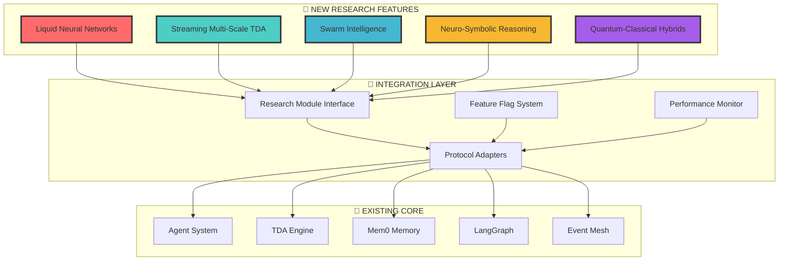
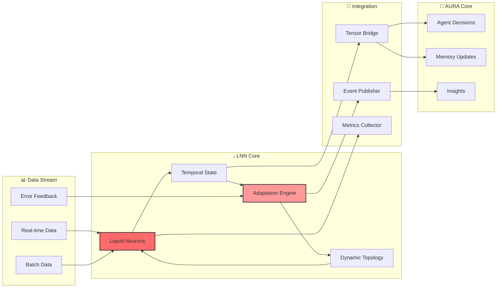
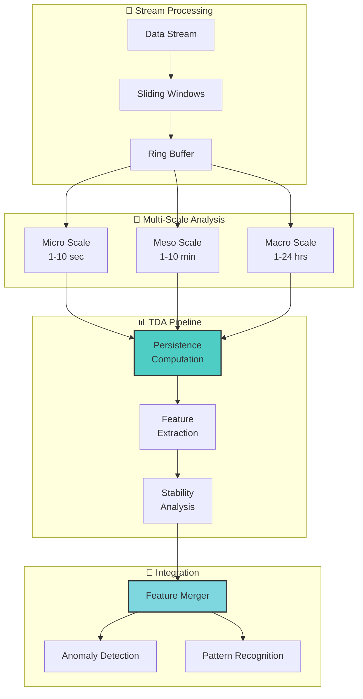
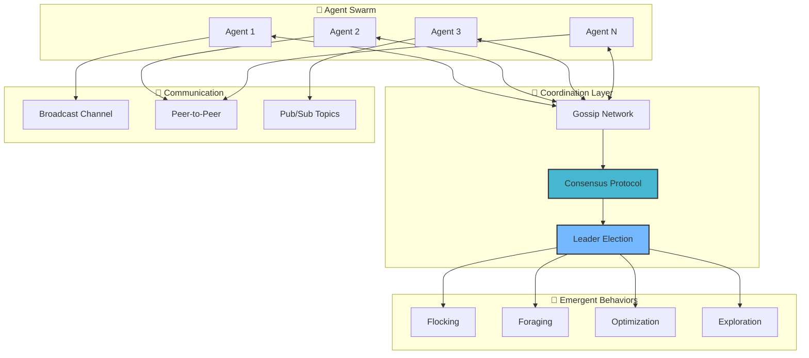
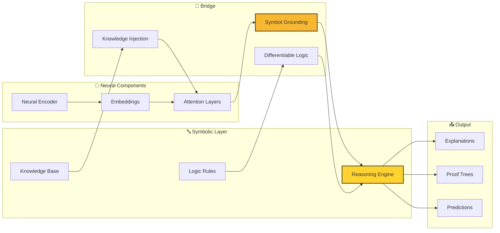
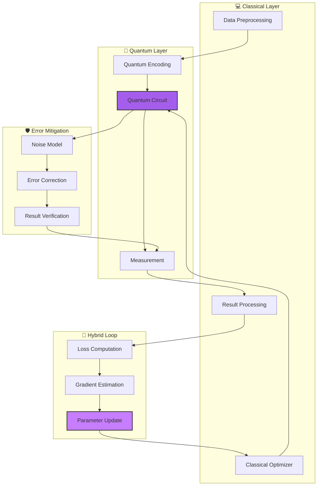
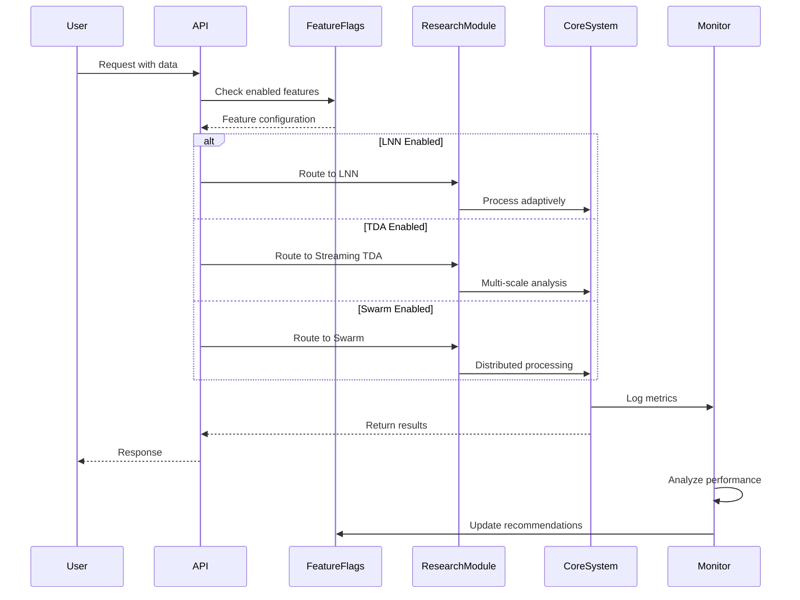
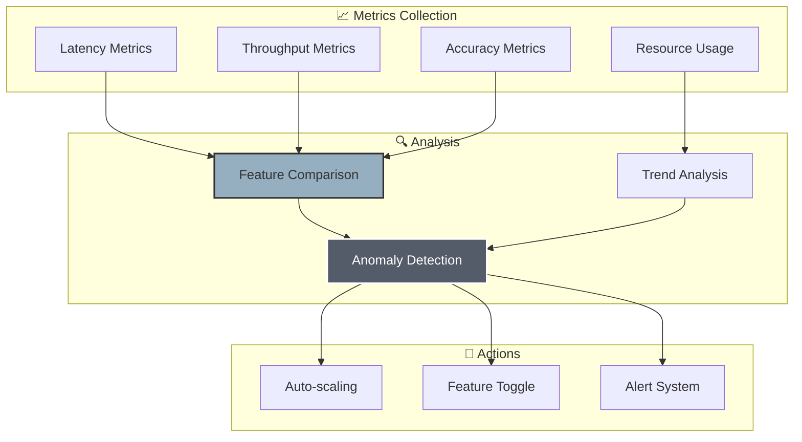
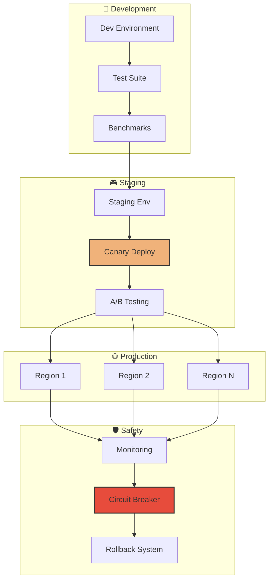
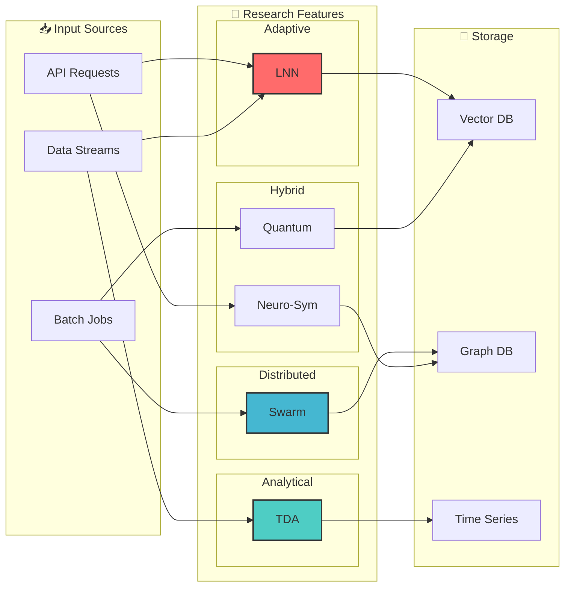

# 📐 NEXT PHASE ARCHITECTURE DIAGRAMS
## Visual Guide to Research Feature Integration

---

## 🏗️ HIGH-LEVEL INTEGRATION ARCHITECTURE

---

## 🧠 LIQUID NEURAL NETWORKS INTEGRATION

---

## 📈 STREAMING TDA ARCHITECTURE

---

## 🐝 SWARM INTELLIGENCE ARCHITECTURE

---

## 🧩 NEURO-SYMBOLIC INTEGRATION

---

## ⚛️ QUANTUM-CLASSICAL HYBRID

---

## 🔄 UNIFIED EVENT FLOW

---

## 📊 PERFORMANCE MONITORING DASHBOARD

---

## 🚀 DEPLOYMENT ARCHITECTURE

---

## 🔗 DATA FLOW INTEGRATION

---

**These architecture diagrams provide a comprehensive visual guide for integrating cutting-edge research features into the AURA Intelligence platform.**

*Visual clarity for revolutionary capabilities!* 🎨🚀