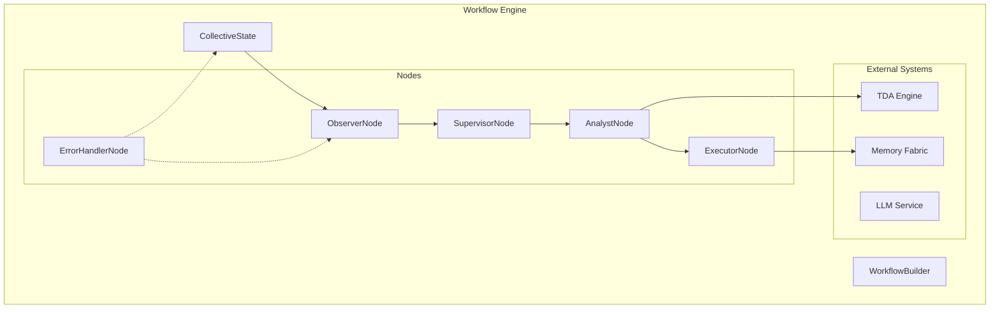

# 🏗️ Workflow Architecture - Living Documentation

**Last Updated:** 2025-01-15  
**Status:** Active Development  
**Version:** 2.0.0

---

## 📋 Overview

The AURA workflow system implements a modular, event-driven architecture for collective intelligence orchestration. Each component has clear boundaries and single responsibilities.



---

## 🔌 Component Contracts

### State Management

**Module:** `state.py`  
**Responsibility:** Immutable state management for workflows

```python
# Input Contract
CollectiveState = TypedDict({
    "workflow_id": str,
    "thread_id": str,
    "messages": List[BaseMessage],
    "evidence_log": List[Dict],
    "supervisor_decisions": List[Dict],
    # ... see state.py for full spec
})

# Operations
create_initial_state(workflow_id, thread_id) -> CollectiveState
update_state_safely(current, updates) -> CollectiveState
```

### Node Interfaces

All nodes follow this contract:

```python
class WorkflowNode(Protocol):
    """Standard interface for all workflow nodes."""
    
    name: str  # Node identifier
    
    async def __call__(
        self,
        state: CollectiveState,
        config: Optional[RunnableConfig] = None
    ) -> Dict[str, Any]:
        """
        Execute node logic.
        
        Returns:
            State updates to apply
        """
        ...
```

---

## 🔄 Data Flow Patterns

### 1. Evidence Collection Flow

```
User Request → Observer Node → Evidence Log → State Update
                    ↓
              System Metrics
              Message History
              Error Patterns
```

### 2. Decision Making Flow

```
Evidence Log → Supervisor Node → Risk Assessment → Decision
                                        ↓
                                  Route Selection
                                  (Continue/Retry/Escalate/Complete)
```

### 3. Analysis Flow

```
Evidence + State → Analyst Node → Pattern Detection → Insights
                        ↓                                 ↓
                   TDA Analysis                    Recommendations
                   (if enabled)
```

### 4. TDA Integration Flow

```
Numerical Data → TDA Request → Algorithm Selection → Computation
                                    ↓                      ↓
                              (SpecSeq++/SimBa)    Persistence Diagrams
                                                          ↓
                                                  Topological Insights
```

---

## 🛡️ Error Handling Strategy

### Circuit Breaker Pattern

Every node is wrapped with `@resilient_operation`:

```python
@resilient_operation(
    name="node_name",
    failure_threshold=3,  # Failures before opening
    recovery_timeout=30   # Seconds before retry
)
```

### Error Propagation

```
Node Failure → Error Log → State Update → Supervisor Decision
                  ↓                              ↓
            Correlation ID                  Retry/Escalate
```

---

## 🔍 Observability

### Correlation ID Flow

```
Request Start → Generate ID → Thread Through All Nodes → Log Aggregation
                                        ↓
                                 External Services
                                  (TDA, Memory)
```

### Metrics Collection

- **Node Level**: Execution time, success/failure
- **Workflow Level**: Total duration, decision paths
- **System Level**: Resource usage, error rates

---

## 🚀 Performance Optimizations

### 1. Lazy Loading
- Nodes loaded only when needed
- External services initialized on-demand

### 2. Async Everywhere
- All I/O operations are async
- Parallel execution where possible

### 3. Caching Strategy
- TDA results cached by data hash
- LLM responses cached with TTL
- Memory queries use hot cache

---

## 🔧 Extension Points

### 1. Custom Analysis Strategies

```python
class MyStrategy(AnalysisStrategy):
    async def analyze(self, evidence, context):
        # Custom analysis logic
        return {"my_patterns": [...]}

# Register with analyst
analyst = create_analyst_node(strategies=[MyStrategy()])
```

### 2. Alternative TDA Algorithms

```python
class MyTDAEngine(TDAEngineInterface):
    async def compute_persistence(self, request):
        # Custom TDA implementation
        return TDAResponse(...)

# Use in analyst
analyst = create_analyst_node(tda_engine=MyTDAEngine())
```

### 3. Custom Nodes

```python
class CustomNode:
    name = "custom"
    
    @with_correlation_id()
    @resilient_operation("custom_node")
    async def __call__(self, state, config=None):
        # Custom logic
        return {"custom_results": [...]}
```

---

## 📊 Benchmarks

### Node Performance (Target)

| Node | P50 Latency | P99 Latency | Throughput |
|------|-------------|-------------|------------|
| Observer | <10ms | <50ms | 1000 req/s |
| Supervisor | <5ms | <20ms | 2000 req/s |
| Analyst | <100ms | <500ms | 100 req/s |
| Executor | <50ms | <200ms | 500 req/s |

### TDA Performance

| Algorithm | Dataset Size | Time | Memory |
|-----------|--------------|------|--------|
| SpecSeq++ | 10K points | 100ms | 100MB |
| SimBa GPU | 1K points | 20ms | 50MB |

---

## 🔄 Migration Guide

### From Monolithic (v1) to Modular (v2)

```python
# OLD (v1)
from workflows import observer_node, supervisor_node

# NEW (v2)
from workflows.nodes import create_observer_node, create_supervisor_node

# OLD (v1)
state = {"messages": [...]}

# NEW (v2)
state = create_initial_state("workflow-id", "thread-id")
```

### Breaking Changes

1. **State Structure**: Now uses TypedDict with required fields
2. **Node Creation**: Use factory functions, not classes
3. **Error Handling**: Automatic with decorators

---

## 🎯 Future Roadmap

### Q1 2025
- [ ] Streaming TDA integration
- [ ] Federated learning nodes
- [ ] Quantum optimization strategies

### Q2 2025
- [ ] Neural architecture search
- [ ] AutoML for strategy selection
- [ ] Edge deployment optimization

---

## 📚 References

- [LangGraph Documentation](https://langchain.com/docs/langgraph)
- [TDA Algorithm Papers](../../../tda/REFERENCES.md)
- [Memory System Design](../../../memory/ARCHITECTURE.md)

---

**Note:** This is a living document. Update whenever architecture changes!